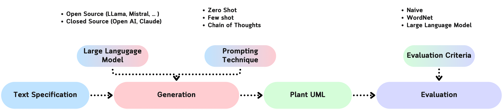

# Text2UML

[](https://github.com/IlKaiser/text2uml/stargazers)
[](https://github.com/IlKaiser/text2uml/network/members)
[](https://github.com/IlKaiser/text2uml/issues)
[](https://github.com/IlKaiser/text2uml/commits/main)
[](https://zenodo.org/records/19599470)

Code for the experiments of the paper **Assessing the Suitability of Large Language Models in Generating UML Class Diagrams as Conceptual Models**

> Calamo, M., Mecella, M., & Snoeck, M. (2025). Assessing the suitability of large language models in generating UML class diagrams as conceptual models. In *International Conference on Business Process Modeling, Development and Support* (pp. 211–226). Springer.

Experimental results are publicly available on **[Zenodo](https://zenodo.org/records/19599470)**.




# Repo Structure

```
text2uml/
├── dataset/            # 45 domain scenarios (description.md + reference UML per case)
├── notebook/           # Jupyter notebooks for each prompting technique and evaluation
├── src/
│   ├── run.py          # Unified runner: generates PlantUML outputs for all configured models
│   ├── eval.py         # Evaluation script: computes F1 scores and generates plots
│   ├── config.yaml     # Runner configuration (techniques, providers, models)
│   └── eval_config.yaml# Evaluator configuration (metrics, plots, ignore list)
├── text/               # Linguistic-complexity metrics on description.md (see text/README.md)
├── experiments/levels/  # Complexity-levels vs. F1 experiment (see below)
├── text_output/        # Level-tagged generation results (result_<technique>_<level>_<model>.txt)
├── results/            # Aggregated evaluation CSVs
├── run_logs/           # Execution logs produced by run.py
├── grammar.ebnf        # EBNF grammar used by eval.py to parse PlantUML
├── images/             # Architecture diagram and generated charts
└── environment.yml     # Conda environment definition
```

For more info on the dataset and the evaluation see the online appendix at [OSF](https://osf.io/rbe7d/files/osfstorage). Aggregated experimental results are also available on [Zenodo](https://zenodo.org/records/19599470).


# Setup

## 1. Setup Python Virtual Environment

Make sure you have [Conda](https://anaconda.org/anaconda/conda) installed, then run:

```sh
conda env create -f environment.yml -p text2uml
conda activate text2uml
```

## 2. Setup .env

Create a `.env` file in the repo root with the API keys for the providers you want to use:

```sh
OPENAI_API_KEY=YOUR_OPENAI_KEY
ANTHROPIC_API_KEY=YOUR_ANTHROPIC_KEY
DEEPSEEK_API_KEY=YOUR_DEEPSEEK_KEY
GOOGLE_API_KEY=YOUR_GOOGLE_AI_KEY
MISTRAL_API_KEY=YOUR_MISTRALAI_KEY
HF_TOKEN=YOUR_HF_TOKEN
LANGCHAIN_TRACING_V2=true
LANGCHAIN_API_KEY=YOUR_LANGSMITH_KEY
```

None of these variables are mandatory — only add the keys for the providers you intend to use. LangSmith tracing is enabled by default when `LANGCHAIN_TRACING_V2=true`; set it to `false` to disable.


# Running the Experiments

## Option A: Unified Runner (recommended)

Edit `src/config.yaml` to enable the providers, models, and prompting techniques you want, then:

```sh
python src/run.py
```

Optional flags:
| Flag | Description |
|---|---|
| `--config PATH` | Use a custom config file instead of the default `config.yaml` |
| `--log-file PATH` | Write logs to a specific file (default: `src/run.log`) |
| `--force` | Recompute and overwrite existing result files |
| `--skip-blank` | Skip existing zero-byte result files instead of retrying them |

### Supported Prompting Techniques

| Key in config | Description |
|---|---|
| `zero_shot` | Direct generation from specification text |
| `one_shot` | One in-context example |
| `few_shot` | Two in-context examples |
| `cot` | Chain-of-Thought (step-by-step class/relation/attribute extraction) |
| `cot_domain` | CoT with an additional noun-extraction step inspired by domain modelling |

### Supported Providers

| Provider key | Description |
|---|---|
| `openai` | OpenAI API (GPT-4o, o-series, GPT-4.1, …) |
| `anthropic` | Anthropic API (Claude 3/4 family) |
| `deepseek` | DeepSeek API |
| `gemini` | Google Gemini API |
| `mistral` | Mistral AI API |
| `huggingface` | HuggingFace Inference Endpoints |
| `huggingface_local` | Local HuggingFace pipeline (downloads and runs on device) |
| `ollama` | Local Ollama server |
| `mlx` | Apple Silicon MLX inference |

Result files are written next to each scenario's `description.md` as `result_{prefix}{model}.txt`.

## Option B: Jupyter Notebooks

For manual or exploratory runs, individual notebooks are available in the `notebook/` folder:

```sh
jupyter notebook
```

Available notebooks: `Zero-Shot.ipynb`, `One-Shot.ipynb`, `Few-Shot.ipynb`, `CoT.ipynb`, `CoT-DomainModelGeneration.ipynb`, `ToT.ipynb`, `Eval.ipynb`, `Dataset.ipynb`, and others.

> **Note:** running models locally requires adequate hardware. Native Apple Silicon (MLX) support is included. To enable CUDA, add your models in the HuggingFace section of `config.yaml`.


# Evaluation

After generating results, run the evaluator to compute F1 scores and produce charts:

```sh
python src/eval.py
```

Optional flags:
| Flag | Description |
|---|---|
| `--config PATH` | Use a custom eval config file instead of `eval_config.yaml` |

Output is written to `dataset/crash_evaluation_results_llm.csv` (configurable) and charts are saved to `graph/`. Aggregated results are also available in `results/`.


# Complexity-Levels Experiment (`experiments/levels/`)

A separate experiment that asks: **does the linguistic complexity of the input
description drive F1?** Each case's spec is rewritten into five complexity
variants (`description_level_zero.md` … `description_level_four.md`, from
minimal to the flattened L4 form, with the original `description.md` as L3 —
see `LevelSpec` in [`experiments/levels/config.py`](experiments/levels/config.py)),
generated and scored independently, then compared.

Result files are level-tagged and written to `text_output/<case>/result_<technique>_<level>_<model>.txt`,
separate from the `src/run.py` outputs alongside each dataset.

## Running it

Corpus-wide, via [`run.py`](experiments/levels/run.py):

```sh
# End-to-end for one model (generate + evaluate + plot):
python -m experiments.levels.run --provider anthropic --model claude-sonnet-4-6

# Re-evaluate + re-plot from already-generated results:
python -m experiments.levels.run --stage evaluate plot --model claude-sonnet-4-6

# Score description complexity (z_index) and correlate it with F1:
python -m experiments.levels.run --stage complexity correlate
```

`--stage` accepts any combination of `generate`, `evaluate`, `plot`,
`complexity`, `correlate`; `--technique` selects any `src/config.yaml`
prompting technique (default `few_shot`); `--datasets`/`--levels` narrow the
run for smoke-testing.

Per-case, via [`case_pipeline.py`](experiments/levels/case_pipeline.py) — reruns
one case through complexity/generate/evaluate/plots/correlate and merges just
that case's rows into the shared CSVs, without recomputing the whole corpus:

```sh
python -m experiments.levels.case_pipeline --case Menso --provider anthropic --model claude-sonnet-4-6
```

## Other modules

- [`snr.py`](experiments/levels/snr.py) — L3 signal-to-noise ratio: how much of
  each case's real description maps to something in the gold diagram
  ("signal") versus narrative elaboration that never surfaces in it ("noise").
  See [`docs/superpowers/specs/2026-07-06-l3-signal-noise-ratio-design.md`](docs/superpowers/specs/2026-07-06-l3-signal-noise-ratio-design.md).
- [`html_report.py`](experiments/levels/html_report.py) — renders a standalone,
  interactive L0-vs-L3 F1 comparison (`python -m experiments.levels.html_report`).

Outputs (CSVs + `svg`/`png` figures, organized into `case_metrics/`,
`levels_bars/`, and `corpus[_<model>]/` subfolders) are written to
`experiments/levels/output/`. Complexity scoring reuses the metrics package
documented in [`text/README.md`](text/README.md).
